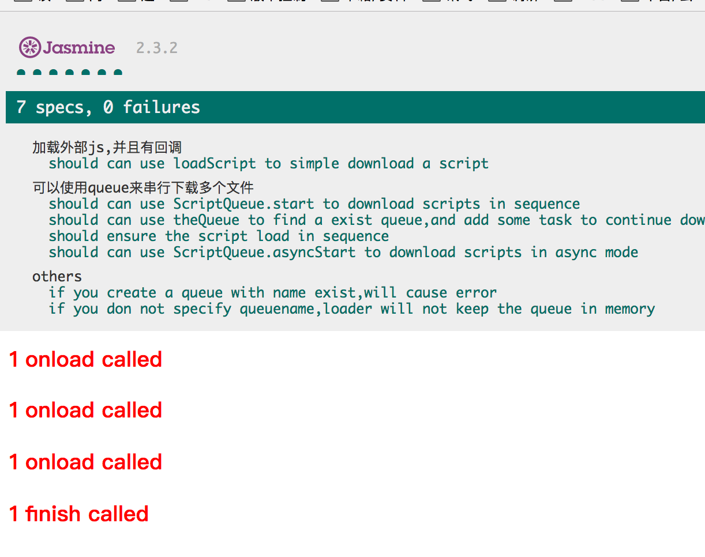

# script loader 的测试

因为脚本加载器在karma测试环境下，和正常浏览器环境下，是不一样的。

所以建议跑jasmineCase_html以及qunitCase下面的用例。

# 如何跑

跑这部分用例，需要先启动server来模拟静态文件服务:

```
$ cd server
node serverstart.js
```

然后打开浏览器输入:

```
http://localhost:19527/test/OneLib.ScriptLoader/jasmineCase_html/test_scriptLoader.html
```

就可以看到测试结果：

